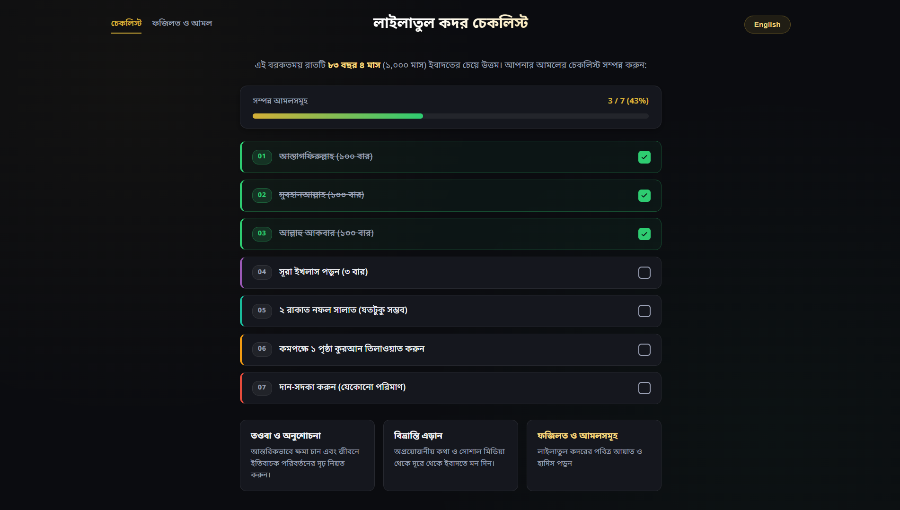
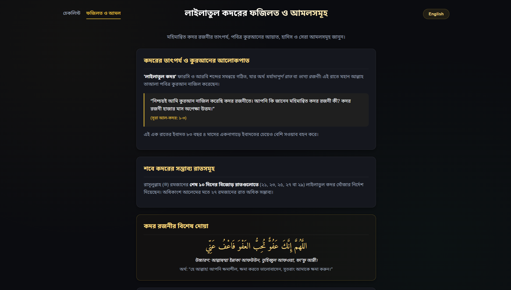

# Laylatul Qadr Checklist & Virtues
A modern, responsive, multi-lingual web application designed to help Muslims track spiritual goals, dhikr, prayers, and learn the virtues of the blessed night of **Laylatul Qadr** (Night of Decree). The website offers a checklist that can be used to complete various spiritual tasks during the night which is considered more valuable than 1,000 months of worship. The website also provides additional information on the **virtues of Laylatul Qadr** and recommended actions (Amal) that can be performed during the night.

## Website Preview

## Features
- 7 Core Spiritual Checklist
- Real-Time Progress Counter
- Multi-lingual Support
- State Persistence
- Virtues & Authentic Hadiths
- Sleek Dark Mode

## Live Demo
Experience the live website: [**Laylatul Qadr Tracker Live**](https://niloyahsan1.github.io/Laylatul-Qadr-Tracker/)

## Tech Stack
- HTML5
- CSS3
- JavaScript (ES6+)
- Google Fonts

## Developed By
- [Niloy Ahsan](https://github.com/niloyahsan1)